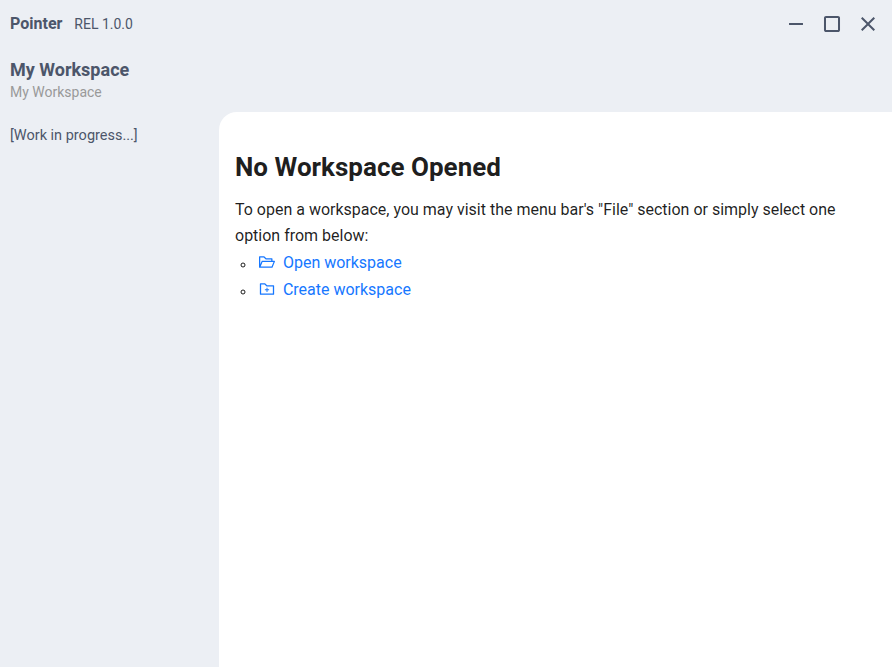

<!-- Template from Best-README-Template -->

<!-- PROJECT SHIELDS -->

<!-- PROJECT LOGO -->
 

<h3 align="center">Pointer</h3>

  

    A local note taking app that utilize Vite + React + TypeScript as front-end, and Node-Addon-API + Morden C++ as back-end.
     
    <a href="https://jihulab.com/MarcusPy827/Pointer/-/wikis/home"><strong>Explore the docs »</strong></a>
     
     
    <a href="https://jihulab.com/MarcusPy827/Pointer/-/releases">Release Page</a>
    &middot;
    <a href="https://jihulab.com/MarcusPy827/Pointer/-/issues/new">Report Bug</a>
    &middot;
    <a href="https://jihulab.com/MarcusPy827/Pointer/-/issues/new">Request Feature</a>
  

<!-- TABLE OF CONTENTS -->

  
Table of Contents

  <ol>
    <li>
      <a href="#about-the-project">About The Project</a>
      <ul>
        <li><a href="#built-with">Built With</a></li>
      </ul>
    </li>
    <li>
      <a href="#getting-started">Getting Started</a>
      <ul>
        <li><a href="#prerequisites">Prerequisites</a></li>
        <li><a href="#installation">Installation</a></li>
      </ul>
    </li>
    <li><a href="#usage">Usage</a></li>
    <li><a href="#roadmap">Roadmap</a></li>
    <li><a href="#contributing">Contributing</a></li>
    <li><a href="#license">License</a></li>
    <li><a href="#contact">Contact</a></li>
    <li><a href="#acknowledgments">Acknowledgments</a></li>
  </ol>

<!-- ABOUT THE PROJECT -->
## About The Project

Pointer is a note-taking app that aims to provide an elegant WYSIWYG markdown editing interface, using React + Electron for a modern user experience and modern C++ for backend.

We are committed to privacy protection. All data in this app is stored locally, and the developers do not have access to any of your data.

(<a href="#readme-top">back to top</a>)

### Built With
#### Frontend
* 
* 
* 
* 
* 

#### Backend

* 
* 

* Library used
  * **Abseli**: Licensed under Apache-2.0, statically inked.
  * **Google Test**: Licensed under BSD-3-Clause, statically linked.
  * **nlohmann/json**: Licensed under MIT, header included in this repository.
  * **mariusbancila/stduuid**: Licensed under MIT, header included in this repository.

(<a href="#readme-top">back to top</a>)

<!-- GETTING STARTED -->
## Getting Started
(WIP)

This is a simplified version, please refer to the documents in `docs` folder for full instructions.

### Prerequisites
You will need these two libraries in your environment path that CMake and gyp could find when compling the backend:
* Abseil
* Google Test

**Notice**: The headers of `nlohmann/json` and `mariusbancila/stduuid` is included in this repository, you don't need to clone & install them.

### Installation
To build this program, you may refer the [wiki](https://jihulab.com/MarcusPy827/Pointer/-/wikis/en/Compile-Guide) here.

(<a href="#readme-top">back to top</a>)

<!-- USAGE EXAMPLES -->
## Usage
The documentation is hosted on the project's main repository [wiki](https://jihulab.com/MarcusPy827/Pointer/-/wikis/).

(<a href="#readme-top">back to top</a>)

<!-- ROADMAP -->
## Roadmap
- [ ] Basic workspace system
- [x] Translation
  - [x] **ZH-CN**: 100%.
  - [x] **EN-US**: 100%, fallback language.

See the [open issues](https://jihulab.com/MarcusPy827/Pointer/-/issues) for a full list of proposed features (and known issues).

(<a href="#readme-top">back to top</a>)

<!-- CONTRIBUTING -->
## Contributing

Contributions are what make the open source community such an amazing place to learn, inspire, and create. Any contributions you make are **greatly appreciated**.

If you have a suggestion that would make this better, please fork the repo and create a pull request. You can also simply open an issue with the tag "enhancement".
Don't forget to give the project a star! Thanks again!

1. Fork the Project
2. Create your Feature Branch (`git checkout -b feature/AmazingFeature`)
3. Commit your Changes (`git commit -m 'Add some AmazingFeature'`)
4. Push to the Branch (`git push origin feature/AmazingFeature`)
5. Open a Merge Request

(<a href="#readme-top">back to top</a>)

### Top contributors:

<!-- LICENSE -->
## License

Distributed under the Apache License Version 2.0. See `LICENSE` file for more information.

(<a href="#readme-top">back to top</a>)

<!-- CONTACT -->
## Contact
Please reach out me using the issue on GitLb, please note that the GitHub repository is just a mirror.

(<a href="#readme-top">back to top</a>)

<!-- ACKNOWLEDGMENTS -->
## Acknowledgments
* othneildrew / Best-README-Template

(<a href="#readme-top">back to top</a>)

